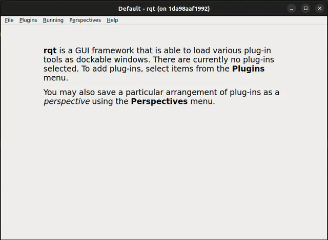
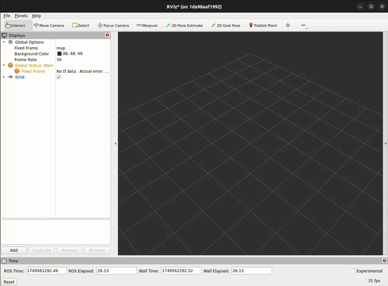

# ros_virtual_joystick

Each XY pad has two main options:

- `Hold Position` - When the `Hold Position` button is pressed, then the XY pad will maintain the last position that it was moved to. When not turned on, then the XY pad will reset back to (0, 0) when the mouse is released.
- `Axis Lock` - When engaged, this will force the XY pad to only move along either the X or Y axis while setting the other axis value to zero.

## Launching the Standalone Node

A standalone node can be launched by running:

```bash
ros2 launch ros_virtual_joystick joystick_node.launch.py
```

This will open the Widget in it's own Qt window.

Launch options:

| Parameter | Type | Description |
|--|--|--|
| `num_pads` | `int` | The number of XY pads to include. Valid values are [`1`, `2`]. |
| `joy_topic` | `str` | The topic to publish the Joy data to. Default to `joy`.

## RQt & RViz Plugins

It is also possible to load the tool in both `rqt_gui` and `rviz2`, meaning that you can build it into existing, more complex GUI setups that utilize more of the ROS ecosystem while reducing the number of windows that you need to have open. In both cases, you can choose between loading a single or dual XY pad and the ABCD buttons.

All the `sensor_msgs/Joy` data is published on the `/joy` topic.

To load into `rqt_gui`, simply open it via the `Plugins/Teleoperation` menu.



To load the panel into `rviz2` select it through the `Panels/Add New Panel` dialogue box.



## Axis Mapping

The axis/button values are encoded and mapped to the `sensor_msgs/Joy` message data as follows:

| Axis | Direction | Value |
|--|--|--|
| `X` | Left | -1 |
| `X` | Right | 1 |
| `Y` | Up | -1 |
| `Y` | Down | 1 |

Each button will hold the value `1` wen pressed and `0` when not pressed.

The joystick and button values are added in the Joy message as follows:

- Joy axes: `[Lx, Ly, Rx, Ry]`
- Joy buttons: `[A, B, C, D]`
